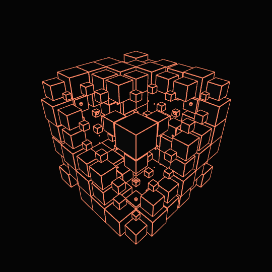

# 💫 Hi there 👋 I’m Sxingzz, 🎮 Game developer!
👯 Open to collaboration on projects that explore innovative mechanics and creative designs. 🤠Eager to learn and improve in areas like performance optimization, AI integration, and multiplayer systems. 💬 Happy to discuss topics like game development, game design, and emerging trends in the industry. ⚡ Fun fact: I enjoy turning ideas into reality through code and experimenting with new technologies in gaming!

## 🌐 Socials:
 

# 💻 Tech Stack:
 
          
# 📊 GitHub Stats:
<table style="width: 100%; table-layout: auto;">
  <tr>
    <td width="50%" style="padding: 0;">
      
      
    </td>
    <td style="padding: 0; width: auto;">
      
    </td>
  </tr>
</table>

---

<!-- Proudly created with GPRM ( https://gprm.itsvg.in ) -->
